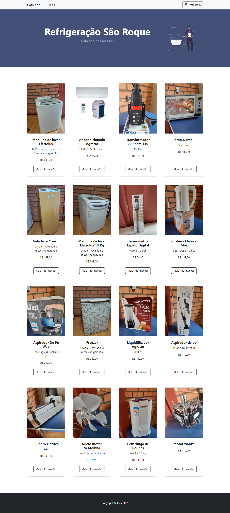

# Local trade catalog.
> Refrigeração São Roque

Project developed to serve as a catalog of a local trade in Brazil


## How to access

```sh
https://refrigeracaosaoroque.netlify.app/
```
   [Netlify](https://refrigeracaosaoroque.netlify.app/) 


## Installation

```sh
Open index.html
```
## Usage: 
    html
    css 
    bootstrap
    vanilla javascript 
   [back4app](https://www.back4app.com/) 


## Release History

* 0.0.1
    

## Meta

Zanchet Luan – [@zanchetluan](https://twitter.com/zanchetluan) – luuanzanchet@outlook.com

[https://github.com/LuanZanchet/catalogorefrigeracao](https://github.com/LuanZanchet)

## Contributing

1. Fork it (<https://github.com/LuanZanchet/catalogorefrigeracao/fork>)
2. Create your feature branch (`git checkout -b feature/fooBar`)
3. Commit your changes (`git commit -am 'Add some fooBar'`)
4. Push to the branch (`git push origin feature/fooBar`)
5. Create a new Pull Request
